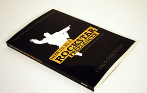

# TRIQ Bootstrap Template

***
*Theme name: TRIQ  
Author: Oskar Żabik  
Created: 11/01/2012  
Version: 1.0*
***

Thank you for your purchase! If you have any questions about this template, feel free to e-mail me at oskar.zabik@gmail.com.

***  
## Table of contents
1. HTML Main Structure
2. CSS Files
3. SASS & COMPASS
4. JavaScript Files
5. Components
	1. Globals
	2. Blog
6. Fonts
7. Browser Compatibility   

***

## 1. HTML Main Structure

The HTML Structure for each page looks as follows:

- Meta 
- Link to CSS files  
  - bootstrap.css 
  - bootstrap-responsive.css
  - triq.css  
  - triq-responsive.css
- HTML5 shiv
- Favicon
- .before-navbar
- .navbar (with menu-button visible only on mobile devices)
- page specifix content
- JavaScript libraries
- footer ( with menu visible only on mobile devices)

## 2. CSS files
You will find a couple of CSS files in template:

- bootstrap.css
- bootstrap-responsive.css
- font-awesome.css
- websymbols.css
- triq.css
- triq-responsive.css

Inside `triq.css` you'll find style guide with keywords to search if you'd like to find particular styles. Use them to easly change your website.

## 3. SASS & COMPASS
Triq was written using [Sass](http://sass-lang.com/) with [Compass](http://compass-style.org/) plugin. Working with Sass is not required, you can easly edit everything without touching Sass files.
Sass files are located inside `sass` folder. You will find there:

- font-awesome.scss (Font Awesome iconic font styles)
- triq.scss (main template styles)
- triq-responsive.scss
- includes:
    - base.scss (containes defined variables, used around every other file)
	- blog.scss 
	- portfolio.scss
	- contact.scss
	- font.scss

Those files are meant to generate three `CSS` files: font-awesome.css, triq.css and triq-responsive.css.

## 4. JavaScript Files
	
- [jQuery 1.8.2](http://jquery.com)
- [jQuery easing 1.3](http://gsgd.co.uk/sandbox/jquery/easing/)
- bootstrap.js
- [QuickSand plugin](http://razorjack.net/quicksand/)
- [scrollTo](http://flesler.blogspot.com/2007/10/jqueryscrollto.html) and [localscroll](http://flesler.blogspot.com/2007/10/jquerylocalscroll-10.html) plugins
- triq.js

## 5. Components

##### GLOBALS

- ##### Responsive navigation:
Triq has different approach to responsive navigation than default Bootstrap navbar (feel free to use bootstrap's though). On top button "Go to nav" will be displayed, while navigation itself will be at the bottom of the page. This way user doesn't have to scroll top/bottom on smaller screens. Here's the code:

		

	      

	        

	          
	          <a href="#footer-nav" class="btn btn-simple visible-phone pull-right">Jump to menu</a>
	          <ul class="nav pull-right hidden-phone">
	            <li><a href="index.html">Home</a></li>
	            ...
	          </ul>
	        

	      

	    

And footer:

		

			

				
This was TRIQ - Awesome bootstrap template.

				
<a id="toplink" href="#">Back to top</a>

				
				<ul id="footer-nav" class="nav visible-phone">
					

					<h3 class="centered">Menu</h3>
					<li class="active"><a href="index.html">Home</a></li>
					...
				</ul>
			

  	  

- ##### Slider with shadow  
	To add nice shadow to your slider, simple add `add-shadow` class. The rest of the markup is the same as on [WrapBootstrap's page ](http://twitter.github.com/bootstrap/javascript.html#carousel):
		
	

		

			<!-- Carousel items -->
			

				
…

				
…

				
…

			

			<!-- Carousel nav -->
			<a class="carousel-control left" href="#myCarousel" data-slide="prev">&lsaquo;</a>
			<a class="carousel-control right" href="#myCarousel" data-slide="next">&rsaquo;</a>
		

- ##### Quote
		
	

		

			<blockquote>
				
Lorem ipsum dolor sit amet, consectetur adipisicing elit.

			</blockquote>
			

				
John Smith

				<cite><a href="#" title="Some website">Some website</a></cite>
				

					
				

			

		

- ##### Buttons

	- Triq adds additional buttons styles. Just add `.btn-simple` class to the button.
		

			<a href="#" class="btn btn-simple btn-info">Info</a>
			<a href="#" class="btn btn-simple btn-success">Read more</a>
			<a href="#" class="btn btn-simple btn-alert">Read more</a>
			<a href="#" class="btn btn-simple btn-warning">Read more</a>
			<a href="#" class="btn btn-simple btn-inverse">Read more</a>
			<a href="#" class="btn btn-simple btn-danger">Read more</a>
	You can also add class `.btn-wide` to make button 100% width block element.
	- CSS3 Animated buttons (with social colors - for ex. add `.color-facebook`)
	

			<a href="#" class="icon-squared color-facebook"><article><i class="icon-facebook"></i></article></a>
    		<a href="#" class="icon-squared color-twitter"><article><i class="icon-twitter"></i></article></a>
      		<a href="#" class="icon-squared color-pinterest"><article><i class="icon-pinterest"></i></article></a>
      		<a href="#" class="icon-squared color-github"><article><i class="icon-github"></i></article></a>
      		<a href="#" class="icon-squared color-linkedin"><article><i class="icon-linkedin"></i></article></a>
	- Combining Font Awesome and CSS styles you can create another social buttons:
	

			<a href="#"><i class="icon-twitter-sign color-twitter"></i></a>
            <a href="#"><i class="icon-facebook-sign color-facebook"></i></a>
            <a href="#"><i class="icon-linkedin-sign color-linkedin"></i></a>
	There are two avaible effects hover (class starting with `hover-`) and normal. The first one changes color of a button just when hovering over, the second one changes it permanently:
		- .hover-color-facebook  
		- .hover-color-twitter 
		- .hover-color-pinterest 
		- .hover-color-github   
		- .hover-color-linkedin 
		- .color-facebook
		- .color-twitter  
		- .color-pinterest 
		- .color-github   
		- .color-linkedin

- ##### CSS3 Animated Menus
Use them to display some short info about your company/app. Keep in mind, that CSS3 animations will only work in modern browsers.

markup:
	
	<ul class="ca-menu unstyled">
	    <li class="span3">
	        <a href="#well-coded">
	            H
	            

	                <h2 class="ca-main">Well coded</h2>
	                <h3 class="ca-sub">Crafted with passion</h3>
	            

	        </a>
	    </li>
	    <li class="span3 active">
            <a href="#docs">
                N
                

                    <h2 class="ca-main">Well documented</h2>
                    <h3 class="ca-sub">You'll never be confused again</h3>
                

            </a>
        </li>
        <li class="span3">
            <a href="#future">
                V
                

                    <h2 class="ca-main">Future is today</h2>
                    <h3 class="ca-sub">HTML5 & CSS3</h3>
                

            </a>
        </li>
        <li class="span3">
            <a href="#purchase">
                L
                

                    <h2 class="ca-main">Purchase</h2>
                    <h3 class="ca-sub">What are you waiting for?</h3>
                

            </a>
        </li>
	</ul>

- ##### Backgrounds
	There are classes with predefined background colors you can use like this:
			
			

				

					Your content goes here
				

			

		
	Avaible classes are:

	- .background-grey
	- .background-light-grey
	- .background-dark
	- .background-blue
	  
  
- ##### Info-centered
Combining this class with buttons and text, you could create something like this:

	

        
Where can you find us?

        <a href="#" class="icon-squared color-facebook">
          <article><i class="icon-facebook"></i></article></a>
        <a href="#" class="icon-squared color-twitter">
          <article><i class="icon-twitter"></i></article></a>
        <a href="#" class="icon-squared color-pinterest">
          <article><i class="icon-pinterest"></i></article></a>
    
  

##### 2. BLOG  
	

Blog posts comes with two options - title on the left and title on the right. You can also change main post color, examples shown below.

	  <!-- le Blog Post -->
      

        <!-- le title -->
        

          

            
26JUL

            <h2><a href="#">This blog post awesome title</a></h2>
          

        

        <!-- le content -->
        

          <!-- le image -->
          

			<!-- Recommended img width == 600px -->
            
          

          <h4>Some short introduction to text</h4>
          
Your content goes here.

        

      

##### 3. PORTFOLIO

Portfolio comes in two versions - full width and thumbnails

- **Thumbnails** - filterable portfolio using Quicksand plugin. Recommended thumbnails size: 300x190px.

	
		<!-- portfolio filtering -->
		<ul id="portfolio-nav" class="nav nav-tabs nav-stacked">
		    <li data-type="all"><a href="#" class="all">All</a></li>
		    <li data-type="util"><a href="#">Utilities</a></li>
		   	...
		</ul>
		
		<!-- portfolio items -->
			<ul id="applications" class="thumbnails portfolio-thumbnails">
			<li data-id="id-1" class="portfolio-item" data-type="util">
			    

		          
		          <a href="#">View project</a>
		        

		    </li>
			<li data-id="id-1" class="portfolio-item" data-type="util">
			    ...
		    </li>
			...
		</ul>

- **Full width**

		

    		

    			

    				<h2>title</h2>
    				
description

    			

    		

    		

    			

    				
    				<a href="#">View project</a>
    			

    		

    	

		<!-- second item -->
		

    		

    			

    				
    				<a href="#">View project</a>
    			

    		

    		

    			

    				<h2>title</h2>
    				
description

    			

    		

    	

		

## 6. Included in TRIQ

- [Font Awesome](http://fortawesome.github.com/Font-Awesome/)
- [WebSymbols Font](http://www.justbenicestudio.com/studio/websymbols/)
- [jQuery 1.8.2](http://jquery.com/)
- [QuickSand plugin](http://razorjack.net/quicksand/)
- [scrollTo](http://flesler.blogspot.com/2007/10/jqueryscrollto.html) and [localscroll](http://flesler.blogspot.com/2007/10/jquerylocalscroll-10.html) plugins

## 7. Fonts

TRIQ uses following fonts from [Google Web Fonts](http://www.google.com/webfonts) directory:

- Lato
- Open Sans Condensed
- PT Sans
- Alegreya (only italic for quotes)

All font styles (font weight, families, sizes and colors) are defined in its own section inside `CSS` files (search for `$FONTS`), or in its own file for SASS (`sass/include/_font.scss`).

